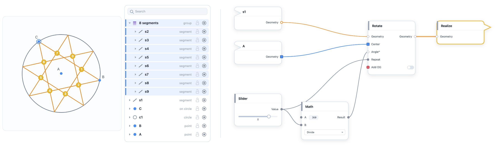

# Locus Studio

**Locus Studio** is a from-scratch app for parametric geometric pattern design —
a compass-and-straightedge construction canvas and a node-based dataflow graph,
bridged live, with exact line-and-arc geometry all the way to clean, precise vector output.
It runs as a native desktop app on **macOS and Windows**.

## 🚀 A public home, ahead of the beta

This repository is Locus Studio's new home in the open — a **release hub**, a
**bug tracker**, and a **living documentation library**, all in one place. We're
standing it up now in preparation for the first **beta-testing release**: the
moment Locus leaves the workshop and lands in other people's hands.

Here's why that's worth being excited about. For a thousand years, the great
geometric patterns — the zellige of Morocco, the girih of the wider Islamic world —
were built with nothing but a straight edge, a compass, string, and tacks. No
rulers and no numbers: a right angle was never *measured*, it *emerged* where two
circles crossed. Locus is that method made computational — compass-and-straightedge
logic and relationships instead of measurements, now driven by a live parametric
node graph and exported as exact geometry. The oldest way to make a pattern,
meeting the newest tool to make it with. The beta will be your invitation to build with it.

**How close is it? Very.** We're in the final stretch — down to the last handful of issues. You can watch it happen in real time: the **[Beta v1 milestone](https://github.com/blossommerz/locus-hub/milestones)** bar fills as those issues close, and the beta ships the moment it reaches 100%.

## ⬇️ Getting Locus

When the beta lands, Locus will be a **standard download, right here on GitHub** — no app store, no account required. Here's how it will work:

1. Open the **[Releases](https://github.com/blossommerz/locus-hub/releases)** page.
2. From the latest release, download the build for your platform — the **macOS** (`.dmg`) or the **Windows** installer.
3. Install and launch it like any other desktop app.
4. On first run, open the **Activate** dialog and follow the [licensing steps](#-community--support) to claim your free one-year beta license.

> **Nothing to download just yet** — the Releases page fills the moment the beta ships. **[Watch this repository](https://github.com/blossommerz/locus-hub)** (the *Watch* button, top-right) or [ask to be notified](#-community--support), and you'll hear the day it goes live.

## 💬 Community & support

- **📣 Get notified at launch** — Locus is entering public beta soon; email an inquiry to **[algoristanm@gmail.com](mailto:algoristanm@gmail.com)** to be told the moment it lands.
- **🎁 Free one-year license** — everyone who actively takes part in the public beta gets one.
- **Questions, ideas, show & tell** — join the conversation in [**GitHub Discussions**](https://github.com/blossommerz/locus-hub/discussions).
- **🔑 Licensing** — copy your machine ID from the app's Activate dialog and email it to **algoristanm@gmail.com**; licenses are issued by email, so machine IDs stay private (never post them on the public boards).

More detail on the [Community & support](https://github.com/blossommerz/locus-hub/wiki/community) wiki page.

## 📖 Documentation

The full documentation lives in the **[Wiki](https://github.com/blossommerz/locus-hub/wiki)** —
browse it with the sidebar there. Start with
[Welcome](https://github.com/blossommerz/locus-hub/wiki/welcome) or
[Your first pattern](https://github.com/blossommerz/locus-hub/wiki/first-pattern).

## 🐞 Bugs & feedback

Please [open an issue](https://github.com/blossommerz/locus-hub/issues/new/choose) —
there's a short bug-report form. Browse
[existing issues](https://github.com/blossommerz/locus-hub/issues) first in case
it's already been raised.
